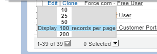
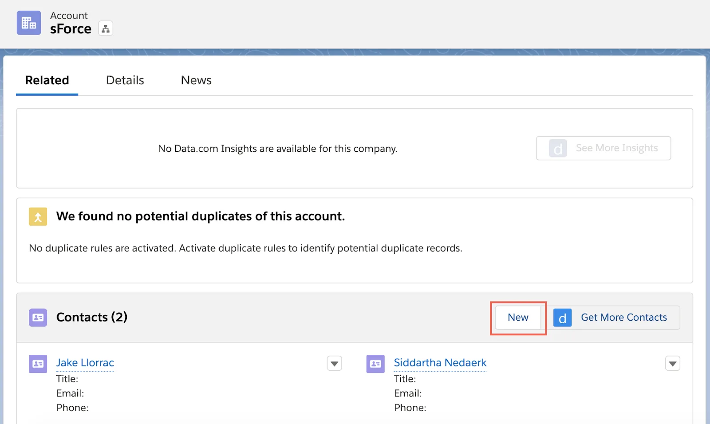
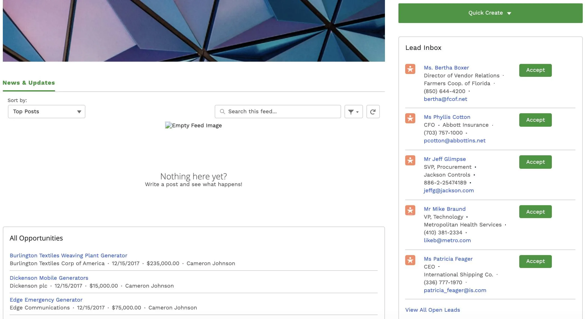

# Create a Partner Site with Experience Cloud 
## Set Up the Site
### Introduction:
In this project we are taking the following steps.  
        1. Create a Custom Profile  
        2. Create a Permission Set  
        3. Set the Admin’s Role  
        4. Enable Digital Experiences  
        5. Edit an Email Template  
        6. Create the Site  
        7. Add a Permission Set to Site Members  

  
####  1. Create a Custom Profile:  
First, clone a standard profile that gives proper access by creating a custom partner profile. Using standard external profiles for self-registration, user creation, and updates to user records isn’t a Salesforce security best practice.  

1. Click the gear icon Setup icon and select Service Setup.
2.  Enter Profiles in the Quick Find box and select Profiles.
3. Click the button at the bottom
    
 and select 100.
4. Click Clone next to Partner Community User.
5. In Profile Name, enter Partner User.
6. Click Save.  
  
#### 2. Create a Permission Set:  
Next, set the proper access permissions by creating the Partner Site permission set.

1. From Service Setup, enter Permission in the Quick Find box and select Permission Sets.
2. Click New.
3. For Label, enter Partner Site Permission Set.
4. Click in the API Name for the API Name to be auto-generated.
5. In the License menu, select Partner Community.
6. Click Save.  
   
####    3. Set the Admin’s Role:    
In the next step of this project, a partner user is created. Before that can be done, the admin (you) must have a higher role than the new partner user.

1. From Service Setup, enter Users in the Quick Find box and select Users.
2. Click **Edit** next to your name (the System Administrator).
3. For Role, select **CEO**.
4. Click Save.  
  
  #### 4. Enable Digital Experiences:  
Now it’s time to turn on the site functionality in your org. 

1. From Service Setup, enter Experiences in the Quick Find box and select Settings.
2. Select the Enable Digital Experiences checkbox.  
**Note:** If enhanced domains are enabled in your org, your digital experiences domain is shown. It includes your My Domain name in the format MyDomainName.my.site.com for production orgs.

If digital experiences is already enabled for your org, skip the remaining steps of Enable Digital Experiences and go to the Edit an Email Template section.

3. In the domain name field enter your domain name—your initials and today’s date (mm-dd-yy).
4. Click Check Availability.
5. Click Save.
6. Click OK on the confirmation message.  
**Note:** If prompted, click Open on the popup box to navigate to this page   

  
  #### 5. Edit an Email Template:   
  Later in the project, a welcome email is sent to all new partner users. To prep for that, create a customized email template.

1. Enter Email Template in the Quick Find box and select Classic Email Templates.
2. Click Edit to the left of the Experience Cloud: New Member Welcome Email.
3. In the Email Body, click Enter/Return twice before “Hi {!Receiving_User.FirstName}”.
4. Add {!Today} to the first blank line of the email.
5. Welcome Email body with today added.
6. Click Save.   
  
    
#### 6. Create the Site:  
Digital Experience functionality is enabled and permissions are set. The next step is to create the Unique Store Asia.

1. From Service Setup, enter All Sites in the Quick Find box and select **All Sites**.
2. Click New.
3. Click the Partner Central template.
4. Click Get Started.
5. In the name field, enter Unique Store Asia.
6. In the optional box, enter partner.
7. Click Create.  
  

#### 7. Add a Permission Set to Site Members:  
  
Next, set which profiles and permission sets have access to the new partner site. 

1. lick the Administration tile.
2. On the sidebar on the left, click Members.
3. In the Available Permission Set list, select Partner Site Permission Set.
4. Click the Add button to the right of the list.
5. Click Save.

##
##  
  
## Designate a Partner Account and User  
  
  #### Enable a Partner Account  

Ursa Major Solar’s partner site needs partners. Once you designate an account as a partner account, it can be linked to the partner site.

1. Click **Administration** in the upper left corner and click **Salesforce Setup** from the menu selector.
2. Click the **App Launcher**  App Launcher icon and select **Sales**.
3. Click the **Accounts** tab.
4. Click the **down arrow** next to Recently Viewed accounts, then select **All Accounts** from the list view.
5. Click **sForce**.
6. Click the **down arrow** next to the action buttons.  

7. Select **Enable As Partner**.
8. Click **Enable As Partner** from the popup.
##  
### Note:   
**If the ***Enable As Partner*** Button is not available then follow the following steps.**  
##  
### Change the Layout:   
#### 1. Account Layout 
1. Click on the gear icon.   
  
2. Click on Setup Button.  
  
3. Click on Object Manager Button.  
  
4. Click on **Account**.
5. In the **Account** Click on **Page Layouts**.  
6. Click on **Account Layout**.  
7. Click on **Mobile & Lightning Actions**.  
  
8. Drag the following buttons to **Salesforce Mobile and Lightning Experience Actions**.  
a. Enable as Partner.  
b. Disable as Partner.
9. Click on **Save** Button to save the changes.    
##  
#### 2. Contact Layout   
1. Click on the gear icon.   
  
2. Click on Setup Button.  
  
3. Click on Object Manager Button.  
  
4. In the **Quick Find** search box, search for **Contact**.  
5. Click on **Contact**.
6. Click on **Contact Layout**.  
7. Click on **Mobile & Lightning Actions**.  
  
8. Drag the following buttons to **Salesforce Mobile and Lightning Experience Actions**.  
a. Enable as Partner.  
b. Disable as Partner.
9. Click on **Save** Button to save the changes  
##   
#### Create a Partner User  
Next, add a new partner user to the newly enabled partner account.

1. From the **sForce account**, click **New** in the Contacts section.  
  
2. Enter the contact name:  
* First Name: ***Kate***  
* Last Name: ***Johnson***  
3. Click **Save**.  
4. Click **Kate Johnson** in the Contacts section of the sForce Account page.  
5. On Kate Johnson’s contact page, click the **down arrow** next to the actions buttons.  
    

6. Select **Enable Partner User**.  
***Note: New User Setup opens.***  
7. From the New User Setup, fill in these details:  

8. Click Save.  
9. Click OK from the popup to confirm that the welcome email will be sent to this new user.
***Note: The welcome email won’t be sent until you activate the site later in this project.***  
##  
#### Assign the User to the Permission Set  
The user and the permission set have been created. Time to join the two. 

1. From Service Setup, enter ***Permission*** in the Quick Find box and select **Permission Sets**.
2. Click **Partner Site Permission Set**.
3. Click **Manage Assignments**.
4. Click **Add Assignments**.
5. Click the **box** (add a check) next to Kate Johnson.
6. Click **Assign**, then **OK**.  
***Note: The welcome email won’t be sent until you activate the site later in this project.***
7. Click **Done**.
##  
## Customize Your Site  
#### Customize the Page Layout  
1. In Experience Builder, hover on **Business Summary** and click the Tabs component (under the geometric purple and blue image).
2. From the Tabs menu on the right, click the **X** next to Business Summary to remove this tab.
3. Click **Delete**.
4. Click **X** to close the Tabs menu.
5. Scroll down and hover over the My Opportunities component. Click **Record List**.
6. From the Record List menu, select **All Opportunities** under Filter Name.
7. Click **X** to close the Record List.
8. Click and drag the **All Opportunities component** to the bottom of the News & Updates component.
***Note: A green box appears around the News & Updates component to assist in component placement.***
9. Click **Preview** to see your page layout changes.
  
## 
# Activate the Site  
Finally, it’s time to activate the site to make it accessible to members. This also triggers the welcome email to be sent to all members.

1. To return to Workspaces, click the Home icon and under My Experiences, select **Unique Store Asia**
2. Click the **Administration** tile.
3. Click **Activate**, then click **OK**.
***Note: Two welcome emails will arrive in your inbox shortly (one for the admin user and the other one for the Partner User, Kate).***